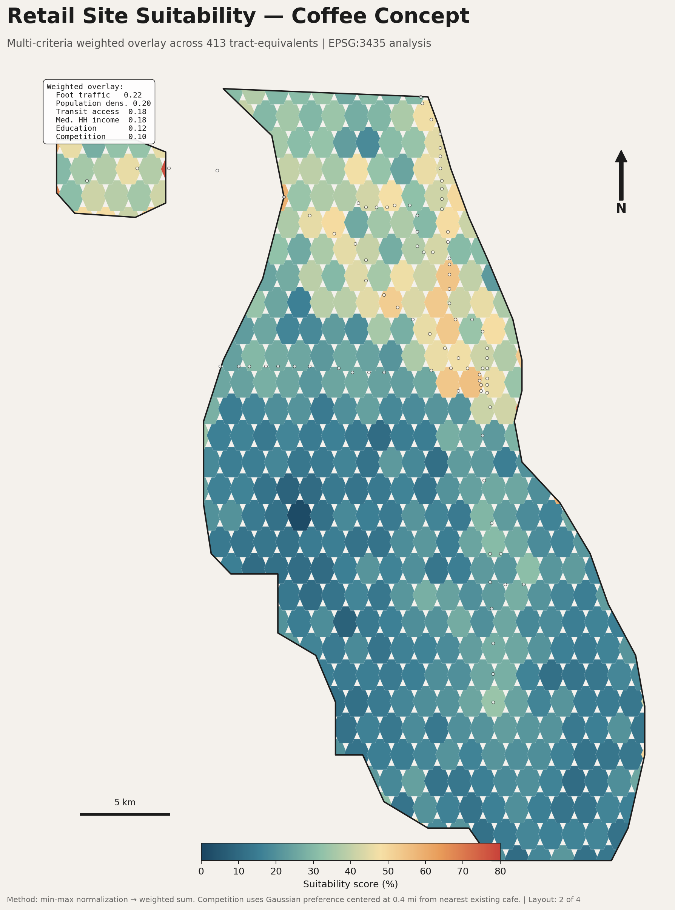
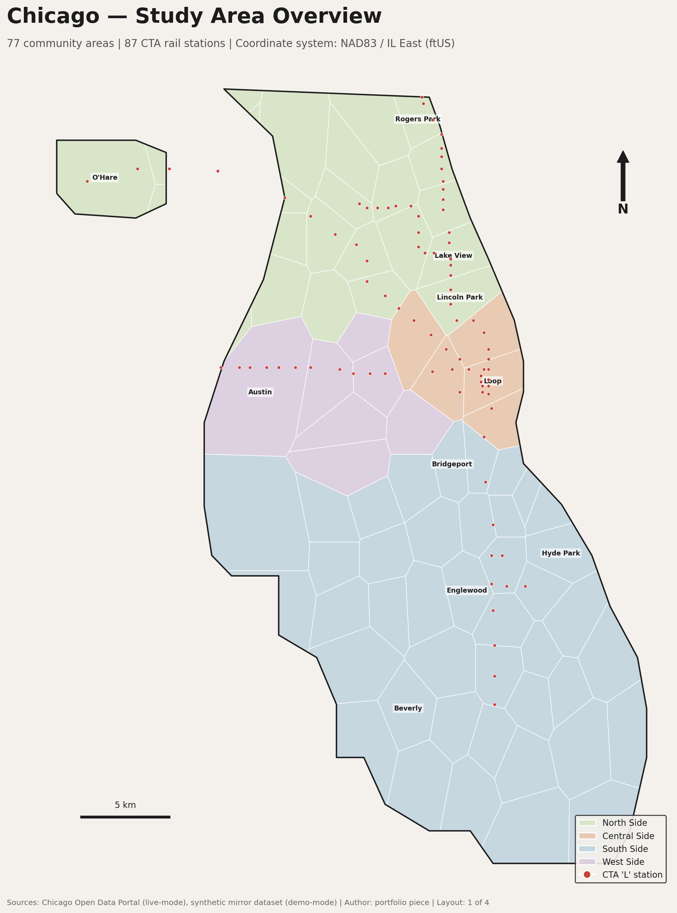
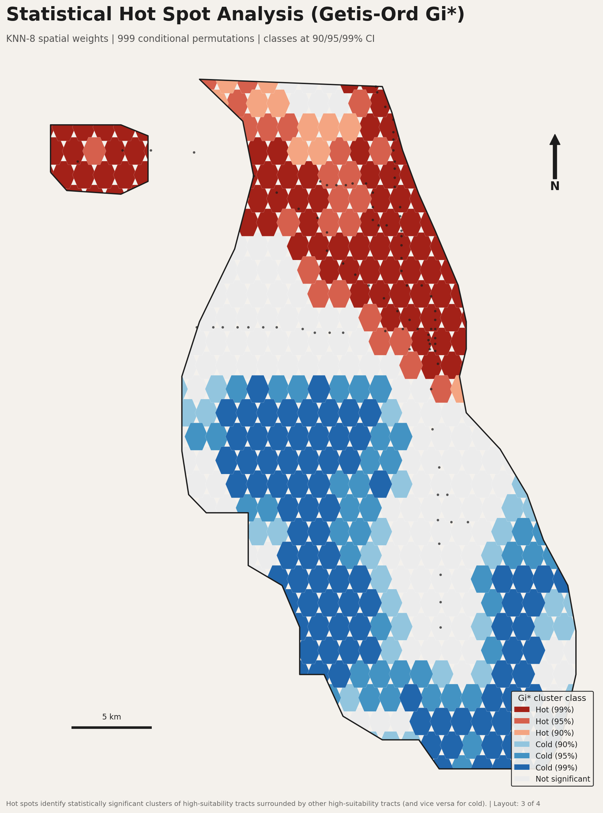
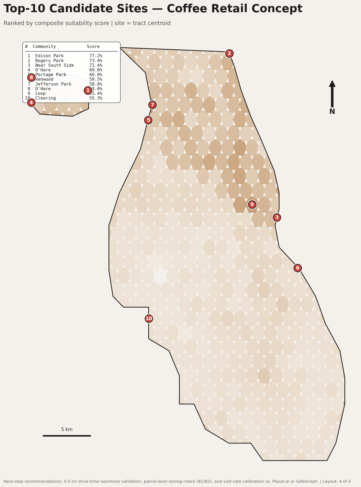

# Chicago Retail Site Selection

> A reproducible multi-criteria GIS suitability analysis identifying the
> highest-potential locations in Chicago for a new urban coffee-retail
> concept. Built in PyQGIS, GeoPandas, and PySAL.



---

## Top-10 candidate sites

| Rank | Community area    | Suitability |
|:----:|-------------------|:-----------:|
| 1    | Edison Park       | 77%         |
| 2    | Rogers Park       | 73%         |
| 3    | Near South Side   | 71%         |
| 4    | O'Hare            | 69%         |
| 5    | Portage Park      | 66%         |
| 6    | Kenwood           | 60%         |
| 7    | Jefferson Park    | 59%         |
| 8    | O'Hare            | 58%         |
| 9    | Loop              | 55%         |
| 10   | Clearing          | 55%         |

Full writeup: **[docs/methodology.pdf](docs/methodology.pdf)** &nbsp;·&nbsp; Editable Word version: **[docs/methodology.docx](docs/methodology.docx)**

---

## The four print layouts

| Study area | Suitability |
|:--:|:--:|
|  |  |
| **Hot spots (Gi\*)** | **Top-10 sites** |
|  |  |

---

## What this project demonstrates

- **Data engineering** — GeoPackage layer management, CRS handling
  (project CRS = EPSG:3435 NAD83 / IL East ftUS, so distances are true feet),
  spatial joins, hex tessellation.
- **Spatial analysis** — six-criterion weighted overlay (income, density,
  education, transit, foot-traffic, competition) with documented weights and
  a Gaussian competition preference.
- **Geostatistics** — Getis-Ord Gi\* local statistic with KNN-8 spatial
  weights and 999 conditional permutations, ArcGIS-equivalent Gi_Bin
  classification at 90 / 95 / 99% CI.
- **Cartography** — programmatic QGIS print layouts via PyQGIS:
  symbolization, labeling, scale bar, legend, A3-portrait.
- **Communication** — a 12-page methodology PDF a non-technical hiring
  manager can read, plus a top-10 ranked candidate table.

---

## How to rebuild from scratch

```bash
# 1. Install Python dependencies
pip install -r requirements.txt

# 2. Build all input layers (synthetic mode — no internet needed)
python3 scripts/data_pipeline.py

# 3. Run the suitability + Gi* analysis
python3 scripts/analysis.py

# 4. Re-render the preview PNGs (optional)
python3 scripts/generate_previews.py

# 5. Assemble the QGIS project (run inside QGIS)
#    Open QGIS Desktop → Python Console → Show Editor →
#    open scripts/build_qgis_project.py → click Run
```

Real Chicago Open Data + U.S. Census ACS endpoints are documented in
[`docs/DATA_SOURCES.md`](docs/DATA_SOURCES.md) and wired into the
`--live` mode of `scripts/data_pipeline.py`.

---

## Repository layout

```
chicago-site-selection/
├── data/                       GeoPackage layers (committed, ~5 MB)
│   ├── community_areas.gpkg
│   ├── tracts.gpkg
│   ├── cta_rail_stops.gpkg
│   ├── competitor_cafes.gpkg
│   ├── foot_traffic_poi.gpkg
│   ├── study_boundary.gpkg
│   └── results.gpkg            (built by analysis.py)
├── scripts/
│   ├── data_pipeline.py        acquisition + cleansing
│   ├── analysis.py             criteria + weighted overlay + Gi*
│   ├── generate_previews.py    matplotlib renders of the 4 maps
│   ├── build_qgis_project.py   PyQGIS — builds the .qgz
│   ├── build_methodology_docx.js  generates docs/methodology.docx
│   └── PROCESSING_MODEL.md     equivalent Model Builder chain
├── project/                    site_selection.qgz lives here once built
├── preview/                    PNG previews of the 4 layouts
├── docs/
│   ├── methodology.pdf         12-page formal writeup
│   ├── methodology.docx        editable Word source
│   └── DATA_SOURCES.md         live endpoint reference
├── requirements.txt
├── LICENSE
├── CITATION.cff
└── README.md
```

---

## Key design choices

- **EPSG:3435** for analysis, not Web Mercator — distance buffers
  (¼-mile walksheds, competitor distance) compute in true feet.
- **Tract-equivalent hex grid** in synthetic mode for an even tessellation;
  drops in directly for TIGER tracts in `--live` mode.
- **KNN-8 weights** for Gi\* — robust to irregular polygon sizes, works
  identically on the hex grid and on real Census tracts.
- **Gaussian competition preference** centered at 0.4 mi — real retail
  siting balances "validated market" against "saturated market"; documented
  in the Starbucks site-selection literature.

---
## Acknowledgments

Built with AI assistance (Claude). Analytical design, methodology, and review are mine.

## License

Code: [MIT](LICENSE). Methodology document: CC-BY-4.0.
